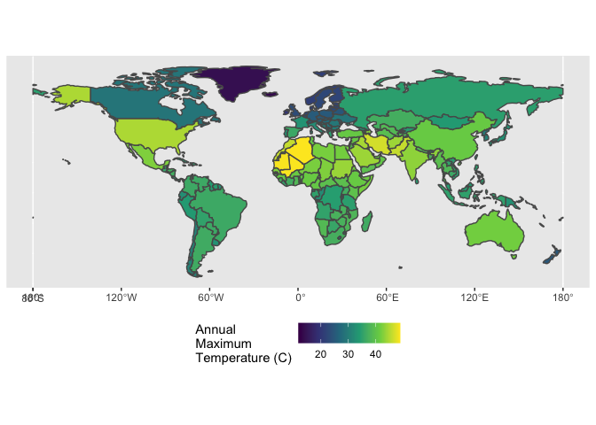

Case Study 06
================
Zhenqi Zhou
October 12, 2021

## import packages

``` r
library(raster)
library(sp)
library(spData)
library(tidyverse)
library(sf)
```

## Load data

``` r
data(world)  #load 'world' data from spData package
tmax_monthly <- getData(name = "worldclim", var="tmax", res=10)
```

## Prepare world data

``` r
world_re <- world %>%
  filter(continent != "Antarctica")
world_re_1 <- as(world_re,"Spatial")
```

## Prepare climate data

``` r
gain(tmax_monthly) <- 0.1
tmax_annual <- max(tmax_monthly)
names(tmax_annual) <- "tmax"
```

## Calculate the maximum temperature observed in each country

``` r
tmax_annual_1 <- raster::extract(x = tmax_annual,y = world_re_1, fun = max, na.rm =T, small = T, sp = T)
tmax_annual_2 <- st_as_sf(tmax_annual_1)
```

## plot the maximum temperature in each country polygon

``` r
ggplot(tmax_annual_2) +
  geom_sf(aes(fill = tmax)) +
  coord_sf(label_graticule = "SW", label_axes = "SW") +
  scale_fill_viridis_c(name="Annual\nMaximum\nTemperature (C)") +
  theme(legend.position = 'bottom')
```

<!-- -->

## find the hottest country in each continent

``` r
hottest_continents <- tmax_annual_2 %>%
  select(name_long, continent, tmax) %>%
  group_by(continent) %>%
  st_set_geometry(NULL) %>%
  arrange(desc(tmax)) %>%
  top_n(1,tmax)

hottest_continents
```

    ## # A tibble: 7 × 3
    ## # Groups:   continent [7]
    ##   name_long                           continent                tmax
    ##   <chr>                               <chr>                   <dbl>
    ## 1 Algeria                             Africa                   48.9
    ## 2 Iran                                Asia                     46.7
    ## 3 United States                       North America            44.8
    ## 4 Australia                           Oceania                  41.8
    ## 5 Argentina                           South America            36.5
    ## 6 Spain                               Europe                   36.1
    ## 7 French Southern and Antarctic Lands Seven seas (open ocean)  11.8
