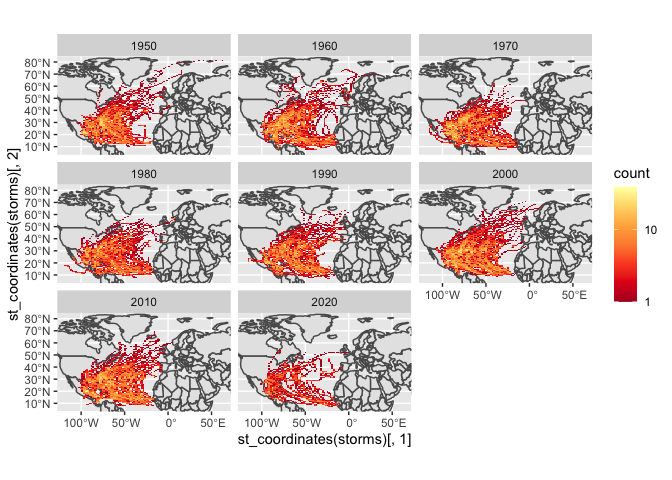

Case Study 09
================
Zhenqi Zhou
November 2, 2021

## import R pacages

``` r
library(sf)
```

    ## Linking to GEOS 3.8.1, GDAL 3.2.1, PROJ 7.2.1

``` r
library(tidyverse)
```

    ## ── Attaching packages ─────────────────────────────────────── tidyverse 1.3.1 ──

    ## ✓ ggplot2 3.3.5     ✓ purrr   0.3.4
    ## ✓ tibble  3.1.4     ✓ dplyr   1.0.7
    ## ✓ tidyr   1.1.3     ✓ stringr 1.4.0
    ## ✓ readr   2.0.1     ✓ forcats 0.5.1

    ## ── Conflicts ────────────────────────────────────────── tidyverse_conflicts() ──
    ## x dplyr::filter() masks stats::filter()
    ## x dplyr::lag()    masks stats::lag()

``` r
library(ggmap)
```

    ## Google's Terms of Service: https://cloud.google.com/maps-platform/terms/.

    ## Please cite ggmap if you use it! See citation("ggmap") for details.

``` r
library(rnoaa)
```

    ## Registered S3 method overwritten by 'hoardr':
    ##   method           from
    ##   print.cache_info httr

``` r
library(spData)
```

## Download zipped data from noaa with storm track information

``` r
data(world)
data(us_states)

dataurl="https://www.ncei.noaa.gov/data/international-best-track-archive-for-climate-stewardship-ibtracs/v04r00/access/shapefile/IBTrACS.NA.list.v04r00.points.zip"
tdir=tempdir()
download.file(dataurl,destfile=file.path(tdir,"temp.zip"))
unzip(file.path(tdir,"temp.zip"),exdir = tdir)
list.files(tdir)
```

    ## [1] "IBTrACS.NA.list.v04r00.points.dbf" "IBTrACS.NA.list.v04r00.points.prj"
    ## [3] "IBTrACS.NA.list.v04r00.points.shp" "IBTrACS.NA.list.v04r00.points.shx"
    ## [5] "temp.zip"

``` r
storm_data <- read_sf(list.files(tdir,pattern=".shp",full.names = T))
```

## plot

``` r
storms <- storm_data %>%
  filter(SEASON >= 1950) %>%
  mutate_if(is.numeric, function(x) ifelse(x==-999.0,NA,x)) %>%
  mutate(decade = (floor(year/10)*10))  

region <- st_bbox(storms)

ggplot() +
  geom_sf(data = world) +
  facet_wrap(~decade) +
  stat_bin2d(data=storms, aes(y=st_coordinates(storms)[,2], x=st_coordinates(storms)[,1]),bins=100) +
  scale_fill_distiller(palette="YlOrRd", trans="log", direction=-1, breaks = c(1,10,100,1000)) +
  coord_sf(ylim=region[c(2,4)], xlim=region[c(1,3)])
```

<!-- --> \#\#
plot

``` r
states <- st_transform(us_states, st_crs(storms)) %>% 
  rename("state" = "NAME") 

storm_states <- st_join(storms, states, join = st_intersects,left = F)

Top_5 <- storm_states %>%
  group_by(state) %>%
  summarize(storms=length(unique(NAME))) %>%
  arrange(desc(storms)) %>%
  slice(1:5)
```
