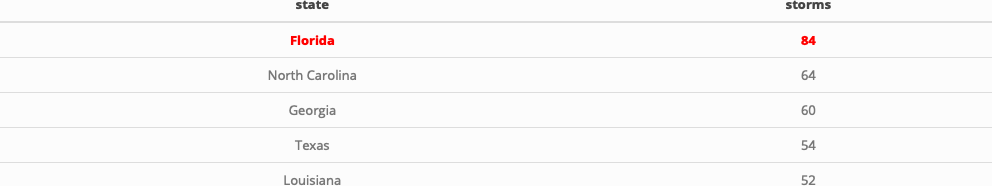

Case Study 09
================
Ryan Zhenqi Zhou
November 2, 2021

## 1. Import R packages

``` r
library(sf)
library(tidyverse)
library(ggmap)
library(rnoaa)
library(spData)
library(kableExtra)
library(knitr)
library(magick)
```

## 2. Upload data

``` r
# upload world, us_states data from spData package
data(world)
data(us_states)
# download zipped data from noaa with storm track information
dataurl="https://www.ncei.noaa.gov/data/international-best-track-archive-for-climate-stewardship-ibtracs/v04r00/access/shapefile/IBTrACS.NA.list.v04r00.points.zip"
tdir=tempdir()
download.file(dataurl,destfile=file.path(tdir,"temp.zip"))
unzip(file.path(tdir,"temp.zip"),exdir = tdir)
list.files(tdir)
```

    ## [1] "IBTrACS.NA.list.v04r00.points.dbf" "IBTrACS.NA.list.v04r00.points.prj"
    ## [3] "IBTrACS.NA.list.v04r00.points.shp" "IBTrACS.NA.list.v04r00.points.shx"
    ## [5] "temp.zip"

``` r
storm_data <- read_sf(list.files(tdir,pattern=".shp",full.names = T))
```

## 3. Wrangle the data

``` r
storms <- storm_data %>%
  filter(SEASON >= 1950) %>%
  mutate_if(is.numeric, function(x) ifelse(x==-999.0,NA,x)) %>%
  mutate(decade = (floor(year/10)*10))  
# use mutate argument to add a column for decade
region <- st_bbox(storms)
# identify the bounding box
```

## 4. Make a summary plot

``` r
ggplot() +
  geom_sf(data = world) +
  # to plot the world polygon layer
  facet_wrap(~decade) +
  stat_bin2d(data=storms, aes(y=st_coordinates(storms)[,2], x=st_coordinates(storms)[,1]),bins=100) +
  scale_fill_distiller(palette="YlOrRd", trans="log", direction=-1, breaks = c(1,10,100,1000)) + # set the color 
  coord_sf(ylim=region[c(2,4)], xlim=region[c(1,3)]) # set the boundary
```

<!-- -->

## 5. Calculate table of the five states with most storms

``` r
states <- st_transform(us_states, st_crs(storms)) %>% 
  rename("state" = "NAME") 
# to reproject us_states to the reference system of the storms object
# rename(NEWNAME = OLDNAME)
storm_states <- st_join(storms, states, join = st_intersects,left = F)
# perform a spatial join between the storm data and states data
Top_5_1 <- storm_states %>%
  group_by(state) %>%
  summarize(storms=length(unique(NAME))) %>%
  arrange(desc(storms)) %>%
  slice(1:5) 
Top_5 <- st_drop_geometry(Top_5_1)
# select the top 5 states which have the most storms

# to make Top_5 table as image
Top_5 %>%
  kable(align = "cc") %>%
  kable_styling() %>% 
  row_spec(1, bold = T, color = "Red") %>% 
  as_image(width = 50, file = "top5.png")
```


