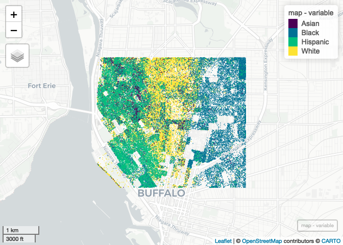

Case Study 11
================
Ryan Zhenqi Zhou
November 17, 2021

# Import packages

``` r
library(tidyverse)
library(spData)
library(sf)

## New Packages
library(mapview) # new package that makes easy leaflet maps
library(foreach)
library(doParallel)
registerDoParallel(4)
getDoParWorkers() # check registered cores
```

    ## [1] 4

# Import tidycensus packagean apply Census API key

``` r
# go to  http://api.census.gov/data/key_signup.html and get a key, then run the line below with your key.  Don't push your key to github!
library(tidycensus)
census_api_key("4cb74396c72ec3e15b6bc14d9c6ea8ca7ffadba0")
```

    ## To install your API key for use in future sessions, run this function with `install = TRUE`.

# Downloads block-level data on population by race in each census block in Buffalo and crop the county-level data

``` r
racevars <- c(White = "P005003", 
              Black = "P005004", 
              Asian = "P005006", 
              Hispanic = "P004003")

options(tigris_use_cache = TRUE)
erie <- get_decennial(geography = "block", variables = racevars, 
                  state = "NY", county = "Erie County", geometry = TRUE,
                  summary_var = "P001001", cache_table=T) 

erie_crop <- st_crop(erie, st_bbox(c(xmin=-78.9,xmax=-78.85,ymin=42.888,ymax=42.92)))
```

# Write a foreach loop

``` r
get_points <- function(df, i)
{
  df %>%
    filter(., variable == i) %>%
    st_sample(., size = .$value) %>%
    st_as_sf() %>%
    mutate(variable = i)
}

map <- foreach(i = unique(erie_crop$variable),.combine = rbind) %dopar%
  {get_points(erie_crop, i)}
```

# make a leaflet map

``` r
mapview(map, zcol = "variable", cex = 0.004, alpha = 0)
```

<!-- -->
