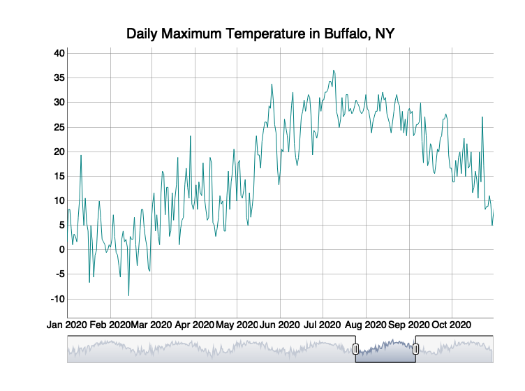

Case Study 12
================
Ryan Zhenqi Zhou
Nov. 22, 2021

# Import packages

``` r
library(dplyr)
```

    ## 
    ## Attaching package: 'dplyr'

    ## The following objects are masked from 'package:stats':
    ## 
    ##     filter, lag

    ## The following objects are masked from 'package:base':
    ## 
    ##     intersect, setdiff, setequal, union

``` r
library(ggplot2)
library(ggmap)
```

    ## Google's Terms of Service: https://cloud.google.com/maps-platform/terms/.

    ## Please cite ggmap if you use it! See citation("ggmap") for details.

``` r
library(htmlwidgets)
library(widgetframe)
```

# Download the daily weather data.

``` r
library(tidyverse)
```

    ## ── Attaching packages ─────────────────────────────────────── tidyverse 1.3.1 ──

    ## ✓ tibble  3.1.4     ✓ purrr   0.3.4
    ## ✓ tidyr   1.1.3     ✓ stringr 1.4.0
    ## ✓ readr   2.0.1     ✓ forcats 0.5.1

    ## ── Conflicts ────────────────────────────────────────── tidyverse_conflicts() ──
    ## x dplyr::filter() masks stats::filter()
    ## x dplyr::lag()    masks stats::lag()

``` r
library(rnoaa)
```

    ## Registered S3 method overwritten by 'hoardr':
    ##   method           from
    ##   print.cache_info httr

``` r
library(xts)
```

    ## Loading required package: zoo

    ## 
    ## Attaching package: 'zoo'

    ## The following objects are masked from 'package:base':
    ## 
    ##     as.Date, as.Date.numeric

    ## 
    ## Attaching package: 'xts'

    ## The following objects are masked from 'package:dplyr':
    ## 
    ##     first, last

``` r
library(dygraphs)
 
d=meteo_tidy_ghcnd("USW00014733",
                   date_min = "2016-01-01", 
                   var = c("TMAX"),
                   keep_flags=T) %>% 
   mutate(date=as.Date(date),
          tmax=as.numeric(tmax)/10) #Divide the tmax data by 10 to convert to degrees.
```

    ## using cached file: ~/Library/Caches/R/noaa_ghcnd/USW00014733.dly

    ## date created (size, mb): 2021-11-28 09:59:06 (8.521)

    ## file min/max dates: 1938-05-01 / 2021-11-30

\# Remaining steps

``` r
d_xts <- xts(d$tmax, order.by = d$date)
dygraph(d_xts, main = "Daily Maximum Temperature in Buffalo, NY") %>%
  dyRangeSelector(dateWindow = c("2020-01-01", "2020-10-31"))
```

<!-- -->
